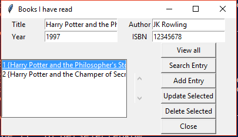

## BookStore

Simple GUI application using **tkinter** and **sqlite** for storing the books you have read, in a database.

Features:
- View all books
- Add a book
- Search for specific book
- Update an entry
- Delete an entry
- Close

 
