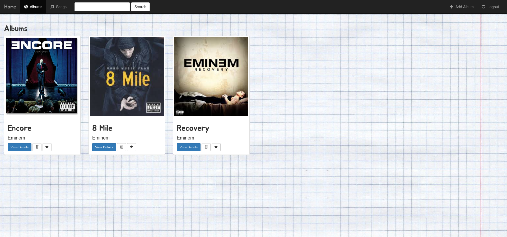

## Music App
#### Tutorial by thenewboston

To run, create a virtual environment, install django and type:
**python manage.py runserver**

#### Home Page

#### Utilities
- Register User **at localhost:8000/register/**
- Create new Albums
- View Album Details
- Add songs **not implemented**
- Delete Albums
- Edit Albums **at localhost:8000/album/{id}**
